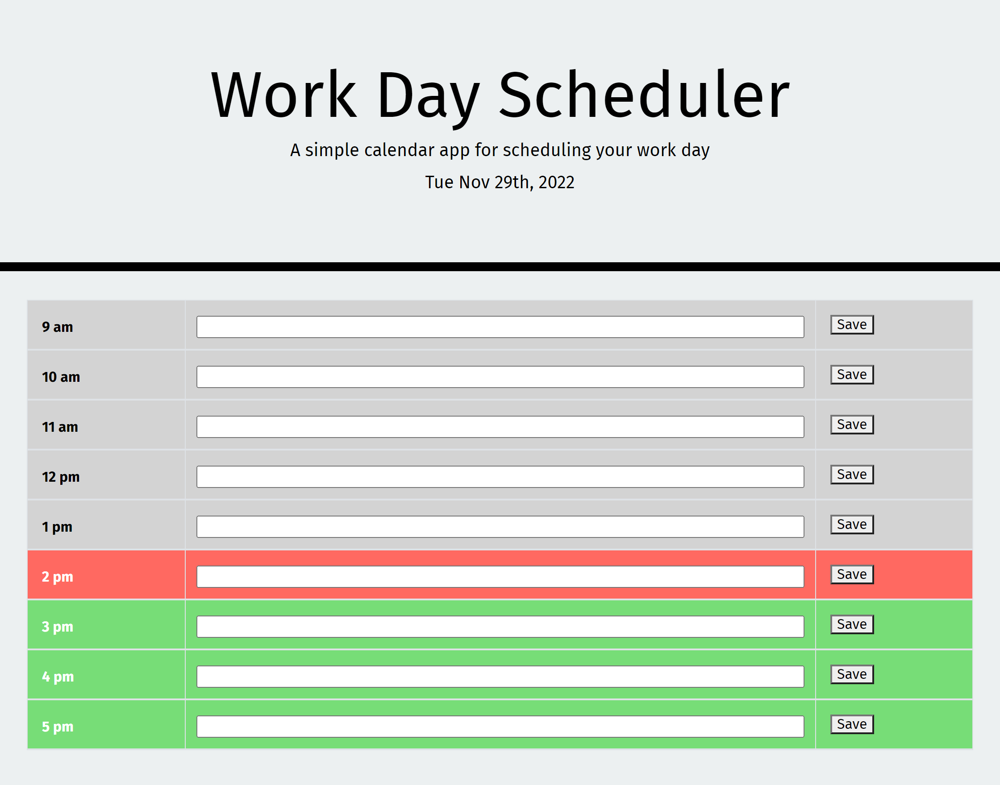

 

# M5 - Work Day Scheduler

## Description

Social Network API is a server database that allows the user to make get, post, put, and delete requests in order to fully manipulate data. It was made in order to practice MongoDB and Mongoose.

Work Day Scheduler is a website that allows you to organize your tasks for the day based on the hour. It was built in order to practice using local storage.

While building this project I learned to:
- Loop through an array of elements selected from the DOM
- Send user input to local storage
- Display items saved to local storage
- Check if the current time and a time on screen are less, equal, or more

### Built With

    

## Table of Contents
- [Installation](#installation)
    - [Screenshot](#screenshot)
- [Usage](#usage)
- [License](#license)
- [Contact](#contact)

## Installation

This is a deployed website so there is no true installation required

1. Navigate to [mateo-wallace.github.io/M5-Work-Day-Scheduler/](https://mateo-wallace.github.io/M5-Work-Day-Scheduler/)

### Screenshot

(<a href="#readme-top">back to top</a>)

## Usage

The website once opened will display rows of varying colors. Green means that time is in the future, red is present, and grey is past. 

You may type a note into each input section in the middle of each row. To save your note click the save button. Now your input is saved within local storage. If you were to reload the page your inputted information will still be on the screen.

(<a href="#readme-top">back to top</a>)

## License

Distributed under the MIT License. See [LICENSE](./LICENSE) for more information.

(<a href="#readme-top">back to top</a>)

## Contact

For any further questions feel free to contact me via:
- GitHub: [Mateo-Wallace](https://github.com/Mateo-Wallace)
- Email: [mateo.t.wallace@gmail.com](mailto:mateo.t.wallace@gmail.com)
- LinkedIn: [Mateo Wallace](https://www.linkedin.com/in/mateo-wallace-57931b254/)

(<a href="#readme-top">back to top</a>)
